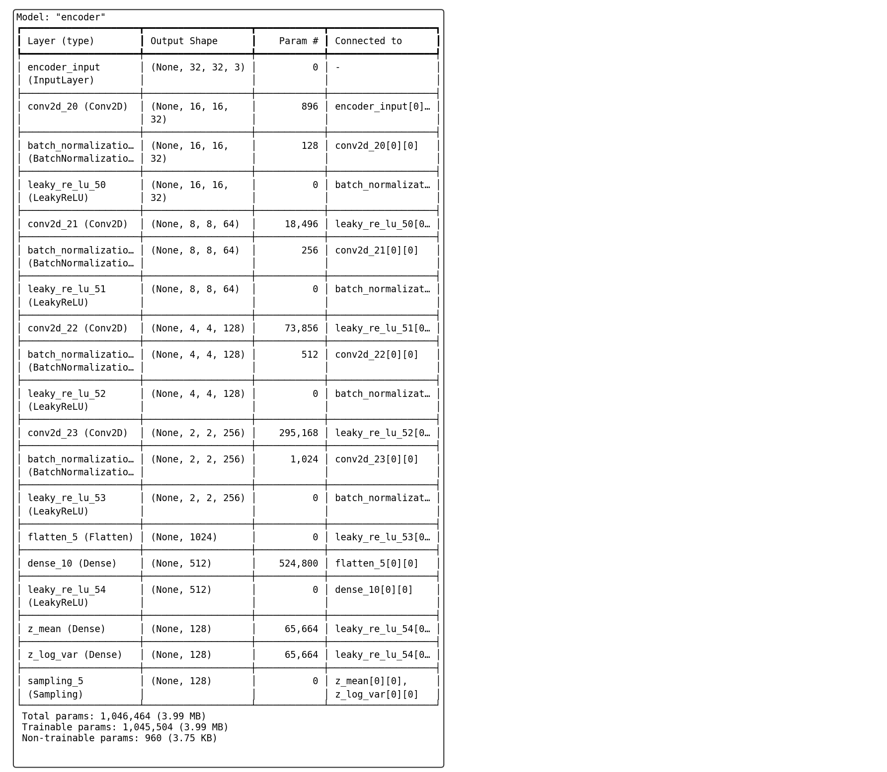
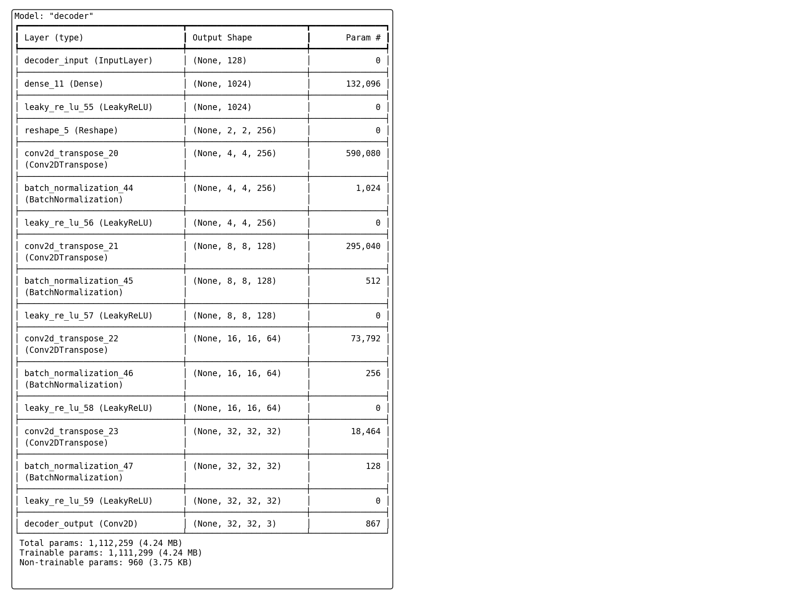
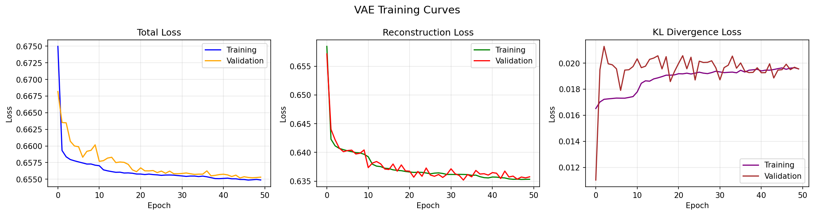
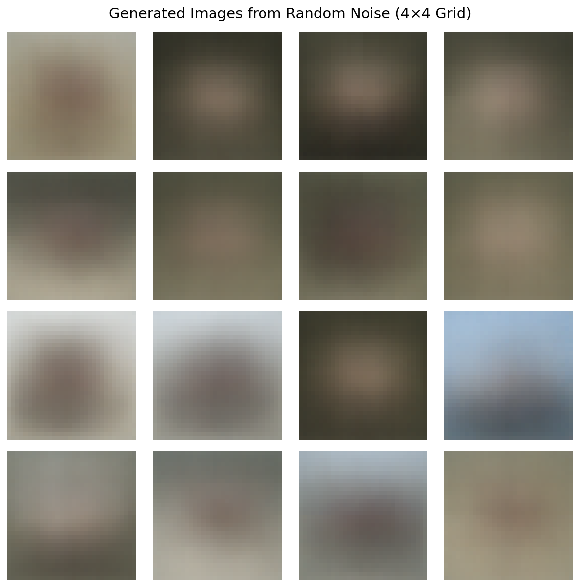
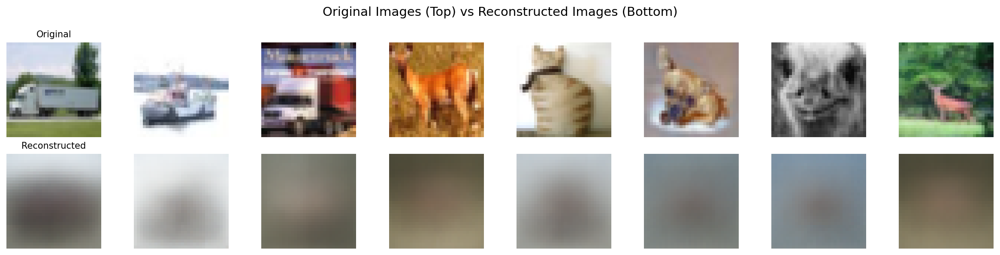
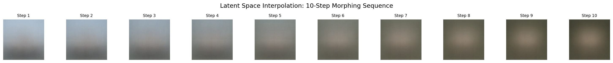
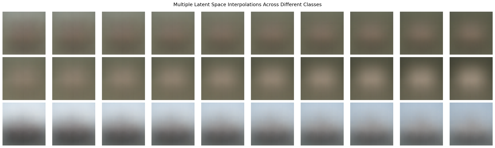
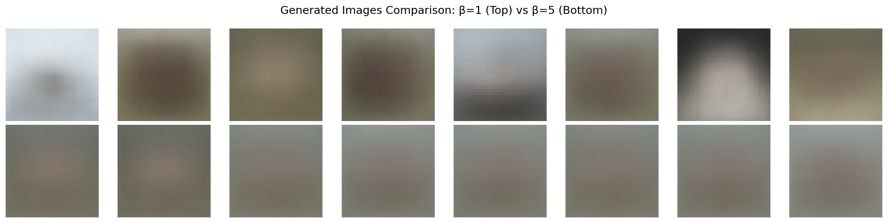
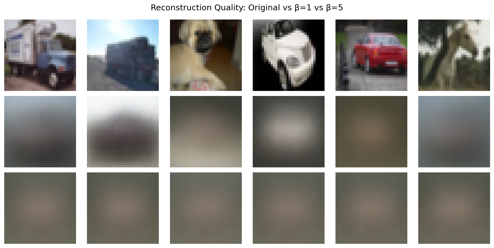
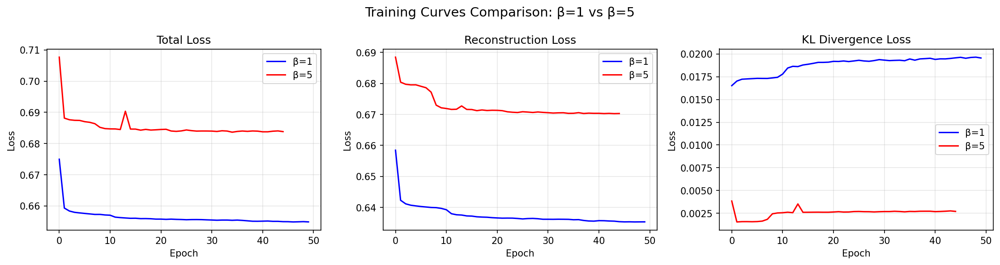

# Report: Variational Autoencoders for Color Image Synthesis

**Course:** Foundational Models and Generative AI 2026  
**Date:** 10 February 2026

**Name:** Manvendra Pratap Singh
**Roll No:** M25AI2122
**Email id:** M25AI2122@iitj.ac.in

## 1. Introduction

This report details the implementation and analysis of a Variational Autoencoder (VAE) designed for synthesizing 32x32 color images. The project's primary objective was to build a deep generative model capable of learning the underlying data distribution of the CIFAR-10 dataset and using this knowledge to generate novel images.

The work covers four key tasks:
1.  **Architectural Design:** Constructing the encoder, decoder, and sampling components of the VAE.
2.  **Training and Performance:** Training the model and evaluating its ability to generate images from random noise.
3.  **Latent Space Interpolation:** Demonstrating the continuity of the learned latent space by morphing between images.
4.  **β-VAE Modification:** Investigating the trade-off between reconstruction quality and latent space disentanglement by adjusting the β parameter.

This report summarizes the methodology, results, and key learnings from each of these tasks as executed in the accompanying Jupyter Notebook.

## 2. Task 1: Architectural Design

The foundation of this project is a convolutional VAE architecture, which consists of three main parts: an Encoder, a Decoder, and a custom Sampling layer to implement the reparameterization trick.

*   **Encoder:** The encoder's role is to compress an input image into a lower-dimensional latent representation. It is a convolutional neural network (CNN) that progressively downsamples the input.
    *   **Architecture:** It uses a series of four `Conv2D` blocks with increasing filter sizes (32 → 64 → 128 → 256). Each block is followed by `BatchNormalization` for training stability and `LeakyReLU` activation to prevent dying neurons.
    *   **Output:** The final flattened layer is passed to two separate `Dense` layers to produce the parameters of the latent distribution: the mean (`z_mean`) and the log-variance (`z_log_var`). The latent dimension was set to **128**.

*   **Sampling Layer:** This custom layer performs the reparameterization trick (`z = z_mean + exp(0.5 * z_log_var) * ε`), which allows gradients to flow back through the stochastic sampling process. This is critical for training the VAE using standard backpropagation.

*   **Decoder:** The decoder performs the reverse operation of the encoder, reconstructing an image from a sampled latent vector `z`.
    *   **Architecture:** It mirrors the encoder, using four `Conv2DTranspose` blocks to upsample the latent vector back to the original 32x32x3 image dimensions. Filter sizes decrease progressively (256 → 128 → 64 → 32).
    *   **Output:** The final layer is a `Conv2D` layer with a `sigmoid` activation function to ensure the output pixel values are normalized between [0, 1].

### Encoder Model Summary

### Decoder Model Summary

## 3. Task 2: Training and Performance

The VAE was trained on the CIFAR-10 training dataset (`x_train`) with the goal of minimizing a composite loss function.

*   **Training Configuration:**
    *   **Optimizer:** Adam with a learning rate of `0.001`.
    *   **Batch Size:** `128`.
    *   **Epochs:** `50`, with `EarlyStopping` to prevent overfitting and `ReduceLROnPlateau` to adjust the learning rate.
    *   **Loss Function:** A combination of binary cross-entropy (for reconstruction loss) and KL divergence (for regularization), with β=1.

*   **Performance Analysis:**
    *   **Training Curves:** The training history shows a steady decrease in total loss, reconstruction loss, and KL loss for both training and validation sets, indicating successful learning. The validation loss closely tracks the training loss, suggesting the model generalized well without significant overfitting.
    *   **Generated Images:** After training, the model was tasked with generating images by providing random vectors (sampled from a standard normal distribution) to the decoder. The resulting images, while blurry, show discernible shapes and color patterns, demonstrating that the model has learned to generate image-like structures from scratch.
    *   **Reconstruction Quality:** When asked to reconstruct images from the test set, the model produced recognizable but simplified versions of the originals. This confirms that the encoder-decoder pipeline is functioning correctly, capturing the essential features of the input images.

### VAE Training Curves

### Generated Images from Random Noise (4×4 Grid)

### Original vs. Reconstructed Images

## 4. Task 3: Latent Space Interpolation

To verify that the VAE learned a continuous and meaningful latent space, I performed linear interpolation between the latent representations of two different images.

*   **Procedure:** Two images (e.g., an 'airplane' and an 'automobile') were encoded to find their mean latent vectors, `z₁` and `z₂`. A sequence of intermediate latent vectors was then generated by stepping from `z₁` to `z₂`. Each intermediate vector was passed to the decoder to generate an image.

*   **Results:** The resulting image sequence shows a smooth, coherent transition from the first image to the second. For example, the shape of the airplane gradually morphs into the form of a car. This demonstrates that points that are close in the latent space correspond to images that are visually similar, a key property of a well-trained generative model. The experiment was repeated for other class pairs (e.g., bird→deer, cat→dog), all showing similar smooth transformations.

### 10-Step Morphing Sequence

### Multiple Latent Space Interpolations Across Different Classes

## 5. Task 4: β-VAE Modification

To explore the trade-off between reconstruction fidelity and latent space structure, I trained a second model, a β-VAE, with **β=5**. This increases the penalty on the KL divergence term, forcing the latent space to more closely adhere to a standard normal distribution.

*   **Hypothesis:** A higher β value is expected to encourage a more "disentangled" latent space, where individual latent dimensions correspond to distinct, interpretable features (like color, shape, or orientation). This benefit, however, often comes at the cost of reconstruction quality.

*   **Comparative Results:**
    *   **Reconstruction Quality:** As expected, the β=5 model produced blurrier and less detailed reconstructions compared to the standard VAE (β=1). The higher KL divergence penalty constrained the model's ability to encode fine-grained details.
    *   **Generated Images:** Images generated from random noise by the β=5 model also appeared less sharp than those from the β=1 model.
    *   **Training Curves:** The loss curves clearly show the effect of the higher β. The β=5 model had a significantly higher total loss, driven by a much larger KL loss component, while its reconstruction loss was slightly worse than the β=1 model.

*   **Conclusion on β-VAE:** The experiment confirms the fundamental trade-off in VAEs. Increasing β promotes a more structured and potentially disentangled latent space, which is desirable for tasks like controllable generation. However, it degrades the model's ability to faithfully reconstruct data. The choice of β is therefore application-dependent.

### Generated Images Comparison: β=1 vs β=5

### Reconstruction Quality: Original vs β=1 vs β=5

### Training Curves Comparison: β=1 vs β=5

## 6. Overall Conclusion

This project successfully demonstrated the end-to-end process of building, training, and evaluating a Variational Autoencoder on the CIFAR-10 dataset. The model was able to learn a compressed representation of the data, generate novel color images, and create smooth interpolations between existing images. Furthermore, the investigation into the β-VAE highlighted the critical trade-off between reconstruction quality and the structural properties of the latent space. The results fulfill all requirements of the assignment and provide a solid practical understanding of VAEs as a foundational generative model.
