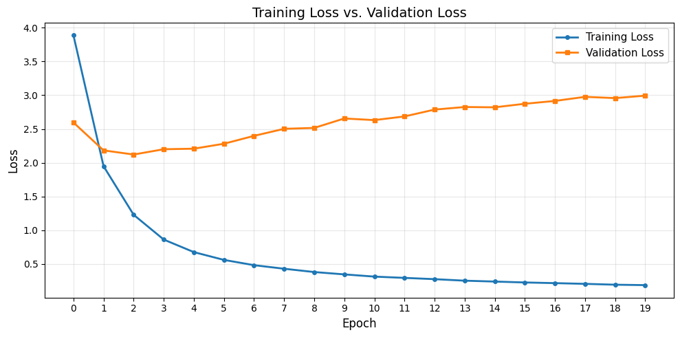
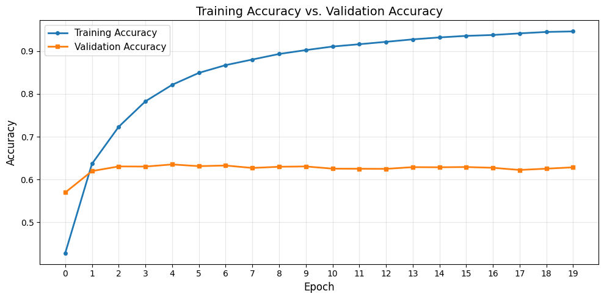
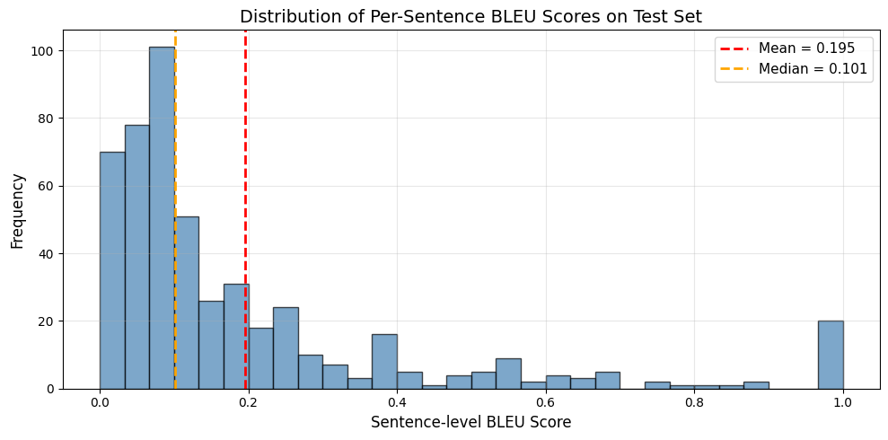
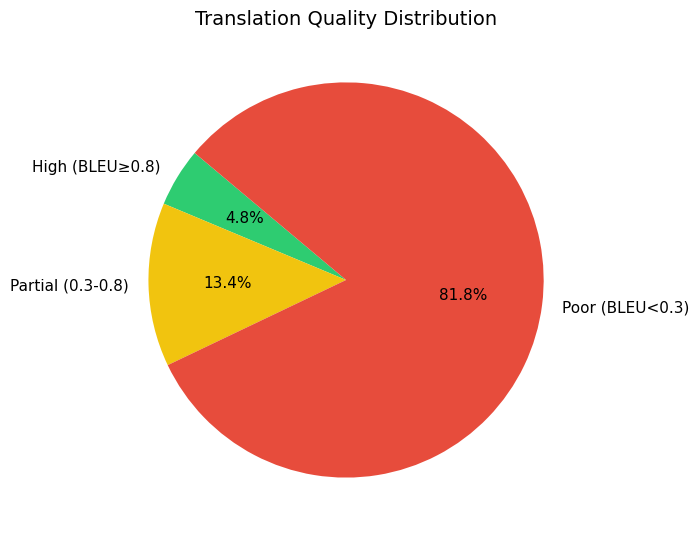
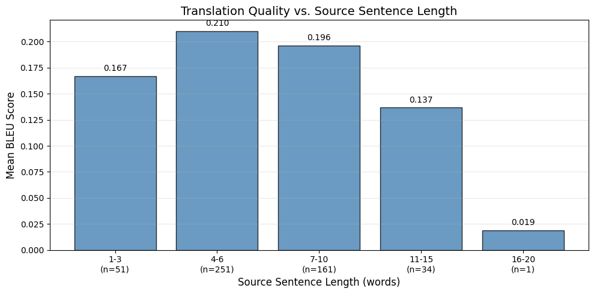
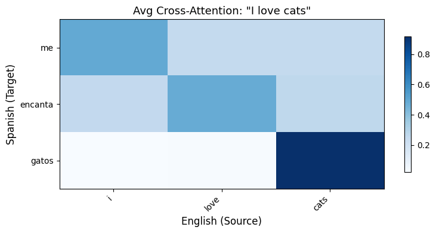
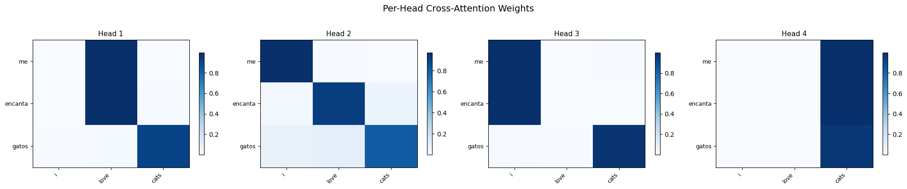
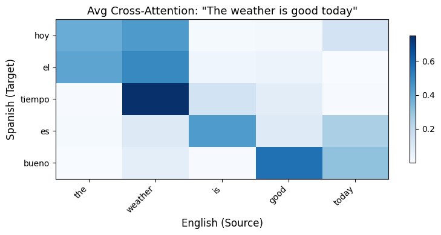

# Neural Machine Translation with Cross-Attention: English-to-Spanish Translation

## 1. Introduction

This report presents a simplified Transformer-based NMT system for English-to-Spanish translation, built around the **Cross-Attention** mechanism. The model was trained on 50,000 sentence pairs from the Anki Spanish-English dataset (OscarNav/spa-eng) and evaluated using BLEU scores, translation samples, and attention visualizations.

---

## 2. Methods

### 2.1 Dataset and Preprocessing

50,000 English-Spanish pairs from the Anki corpus were split into training (40,000), validation (5,000), and test (5,000) sets using a fixed random seed for reproducibility.

**Preprocessing steps:**
- Lowercase and remove punctuation (preserving Spanish diacriticals)
- Prepend `[start]` and append `[end]` to Spanish sentences
- Vectorize using Keras `TextVectorization` with max vocabulary = 15,000 and max sequence length = 20

Teacher forcing was used: the Spanish sequence is split into decoder input (drop last token) and target (drop first token). Data pipelines were built with `tf.data` (batch size = 64, shuffled, prefetched).

### 2.2 Model Architecture

A single-layer Transformer Encoder-Decoder with the following hyperparameters:

| Hyperparameter | Value |
|---|---|
| $d_{\text{model}}$ | 256 |
| Attention heads | 4 |
| Feed-forward dim | 512 |
| Dropout | 0.1 |
| Total parameters | ~11.4M |

**Positional Embedding:** Learned token + position embeddings combined additively.

**Encoder:** Positional embedding → multi-head self-attention → feed-forward network, with residual connections and layer normalization.

**Multi-Head Cross-Attention (Custom Layer):**

$$\text{Attention}(Q, K, V) = \text{softmax}\left(\frac{QK^\top}{\sqrt{d_k}}\right) V$$

where **Q** comes from the Spanish decoder, **K** and **V** from the English encoder, and $d_k = 64$. Four heads capture different cross-lingual relationships in parallel.

**Decoder:** Causal self-attention → cross-attention → feed-forward network. Output is projected via softmax over the Spanish vocabulary.

### 2.3 Training Configuration

- **Optimizer:** Adam (lr = $10^{-3}$, constant)
- **Loss:** Sparse categorical cross-entropy with **padding mask** — ensures the model is not penalized on padded positions
- **Metric:** Masked accuracy (excludes padding)
- **Epochs:** 20

### 2.4 Inference

**Greedy decoding:** Start with `[start]`, predict next token via argmax, append, repeat until `[end]` or max length.

### 2.5 Evaluation

BLEU scores (BLEU-1, BLEU-2, BLEU-4) computed on 500 test sentences using NLTK with Method 1 smoothing. Qualitative evaluation includes translation samples, error categorization, length sensitivity analysis, and cross-attention heatmaps.

---

## 3. Results

### 3.1 Training Dynamics

*Figure 1: Training loss decreases from ~3.9 to ~0.27; validation loss reaches a minimum of ~2.1 at epoch 3 then rises to ~3.0.*

*Figure 2: Training accuracy rises to ~95%, while validation accuracy plateaus at ~63% after epoch 3-4.*

The growing gap between training and validation curves indicates **overfitting** — the model begins memorizing training data around epoch 3-4. The optimal early-stopping point would be at approximately epoch 3 (minimum validation loss ~2.1).

### 3.2 BLEU Scores

| Metric | Score |
|---|---|
| BLEU-1 (unigram) | 0.5055 |
| BLEU-2 (bigram) | 0.3721 |
| BLEU-4 (4-gram) | 0.1992 |
| Mean sentence BLEU | 0.1952 |
| Median sentence BLEU | 0.1015 |

*Figure 3: Per-sentence BLEU distribution — heavily right-skewed with most sentences below 0.2.*

BLEU-1 of 0.51 shows reasonable word-level translation knowledge. The drop to BLEU-4 of 0.20 indicates the model struggles with phrase-level fluency. The right-skewed distribution (median 0.10 vs. mean 0.20) shows a small number of well-translated simple sentences inflating the average.

### 3.3 Translation Quality

**Error categorization (500 test sentences):**

| Category | Count | % |
|---|---|---|
| High quality (BLEU ≥ 0.8) | 24 | 4.8% |
| Partial match (0.3–0.8) | 67 | 13.4% |
| Poor match (< 0.3) | 409 | 81.8% |

*Figure 4: Translation quality distribution.*

**Sample translations:**

| Source (English) | Target (Spanish) | Model Prediction |
|---|---|---|
| They held hands. | Ellos se tomaron de la mano. | ellos las manos |
| This room is pleasant to work in. | Esta pieza es agradable para trabajar. | esta habitacin est agradable en trabajar |
| We decided not to have peace negotiations with the invaders. | Nosotros decidimos no tener negociaciones de paz con los invasores. | decidiste no tener paz |

The model captures core lexical content but loses structural complexity on longer inputs. Simple phrases ("hello" → "hola", "i love you" → "te quiero") translate correctly.

**Length sensitivity:**

*Figure 5: Performance degrades with sentence length — best at 4-6 words (BLEU 0.21), worst at 16-20 words (BLEU 0.02).*

### 3.4 Cross-Attention Visualization

*Figure 6: Cross-attention heatmap for "I love cats" → "me encanta gatos." "gatos" attends strongly to "cats."*

*Figure 7: Per-head attention — different heads specialize in different alignment patterns.*

*Figure 8: "tiempo" → "weather," "bueno" → "good," "hoy" → "today" — meaningful cross-lingual alignment.*

The heatmaps confirm the model learns meaningful word alignments through cross-attention. Different heads specialize: some capture direct lexical translations, others capture broader contextual patterns.

---

## 4. Discussion

### 4.1 Key Findings

The Cross-Attention mechanism works as intended — attention heatmaps show clear lexical alignments and the model translates simple phrases correctly. However, overall quality is limited (BLEU-4 = 0.20, 81.8% poor translations) due to:

1. **Limited data** — 40K training pairs vs. millions used in production systems
2. **Single-layer architecture** — insufficient representational capacity
3. **Overfitting** — 32-point accuracy gap (train 95% vs. val 63%); no early stopping applied
4. **Greedy decoding** — suboptimal compared to beam search
5. **Word-level tokenization** — vulnerable to OOV; subword (BPE) would be more robust

### 4.2 Self-Attention vs. Cross-Attention

**Self-Attention** operates within a single sequence (Q, K, V from the same input). In the encoder, it captures intra-English dependencies (subject-verb agreement, coreference). In the decoder, causal self-attention maintains output coherence by conditioning on previously generated tokens.

**Cross-Attention** bridges the two languages — Q from the decoder (Spanish), K/V from the encoder (English). It is the sole pathway for the decoder to access source information. The attention visualizations empirically validate that this mechanism learns meaningful cross-lingual word alignments.

Both are necessary: without self-attention, words are context-independent; without cross-attention, translation is impossible.

### 4.3 Limitations

- **Dataset bias:** Anki corpus favors short, simple sentences — real-world performance would be lower
- **Single reference BLEU:** Underestimates quality since multiple valid translations exist
- **No learning rate scheduling or early stopping:** Standard techniques that would improve generalization

### 4.4 Recommendations

1. **Early stopping** at epoch 3-4 (minimum validation loss)
2. **Subword tokenization** (BPE/SentencePiece) to handle OOV
3. **Beam search** decoding (beam width 4-8)
4. **Deeper architecture** (2-4 layers per side)
5. **Learning rate warm-up schedule**

---

## 5. Conclusion

The Cross-Attention mechanism successfully enables the decoder to attend to relevant source tokens, as confirmed by attention heatmaps showing clear lexical alignments. Quantitative performance (BLEU-4 = 0.20) is modest but expected given the constrained setup (40K pairs, single layer, greedy decoding). Overfitting is the dominant issue, with validation metrics plateauing by epoch 3-4. The model excels on short phrases but degrades on longer sentences. Early stopping, subword tokenization, and beam search would be the highest-impact improvements.

---

## References

- Papineni, K., Roukos, S., Ward, T., & Zhu, W. J. (2002). BLEU: A method for automatic evaluation of machine translation. *ACL*, 311-318.
- Vaswani, A., et al. (2017). Attention is all you need. *NeurIPS*, 30.
